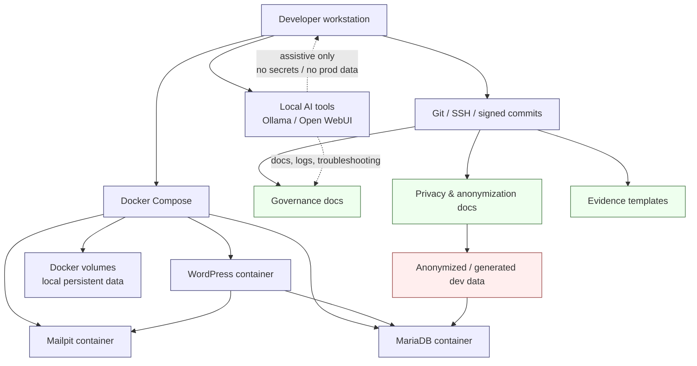
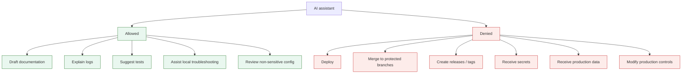

# local-first-wordpress-devsecops-kit
Local-first DevSecOps starter kit for regulated WordPress development: Docker Compose, privacy-safe data handling, AI boundaries, runbooks and audit evidence templates.


**A lightweight, auditable and recoverable local development model for regulated WordPress-based platforms.**


---
## Validation status

Validated locally on Windows with WSL2, Docker Desktop and Git Bash.

Runtime result:
- WordPress available at `http://localhost:8080`
- Mailpit available at `http://localhost:8025`
- MariaDB reached healthy state
- Docker Compose lifecycle tested: `up`, `ps`, `down`, `up -d`, `exec`
- WordPress container shell access validated with `docker compose exec wordpress bash`
- Local Lighthouse audit captured for `http://localhost:8080/wp-admin/plugins.php`

Detailed evidence:
- `docs/evidence/LOCAL_VALIDATION_2026-06-15.md`
- `docs/evidence/LIGHTHOUSE_AUDIT_2026-06-15.md`
- `docs/ops/DOCKER_COMPOSE_LIFECYCLE_AUDIT.md`
## Purpose

This repository demonstrates a **local-first DevSecOps development baseline** for WordPress-based platforms that may later need to operate in regulated, privacy-aware or multi-tenant environments.

The goal is not to create a production platform locally.

The goal is to make local development:

* repeatable
* recoverable
* understandable
* safe by default
* easy to onboard
* auditable enough for early-stage governance
* protected from accidental production-data and AI-context leakage

In short:

> Anyone in the team should be able to clone the repository, start the stack and understand what is running — without cargo-culting Docker, leaking data or depending on one person’s memory.

---

## Core idea

Most local development environments fail in the same way:

* setup depends on one person
* production data gets copied casually
* secrets end up in repositories or chats
* Docker is used without understanding what it actually isolates
* AI tools are given too much context
* no one knows what is safe to reset
* environments drift until they become snowflakes

This kit addresses those problems with a small, explicit and documented baseline:

```text
Docker Compose runtime
+ WordPress development stack
+ Git / SSH / signed commit workflow
+ no production data in development
+ anonymized dataset handling model
+ local AI boundary model
+ developer runbooks
+ evidence templates
```

---

## Architecture overview



---

## Architecture principle

**Code is debt.**

Not because code is bad, but because every line creates future responsibility: maintenance, security, documentation, testing, ownership and operational risk.

Documentation is an asset when it makes the system understandable, transferable and recoverable.

Tests and audit evidence are what keep technical debt from becoming organizational risk.

**Complexity is not maturity.**
**Maturity is knowing what not to build yet.**

This kit intentionally stays small.

It is not Kubernetes.
It is not a production orchestration platform.
It is not an enterprise IAM system.
It is not a security silver bullet.

It is a controlled local development foundation.

---

## What this project is

This is:

* a local WordPress development runtime
* a Docker Compose onboarding model
* a privacy-aware development workflow
* a governance-oriented documentation baseline
* a local-first AI workflow boundary model
* a starter kit for regulated or compliance-sensitive development teams

This is not:

* a production deployment strategy
* a hardened production architecture
* a full CI/CD release platform
* a complete data anonymization product
* an enterprise GRC system
* a replacement for proper security review
* a replacement for production-grade secrets management

---

## Target use cases

This kit is useful when a team needs to develop WordPress-based or PHP-based systems where local development must still respect operational discipline.

Good fit:

* WordPress platform development
* regulated or semi-regulated web platforms
* early-stage MedTech / healthtech / public-sector-adjacent projects
* multi-tenant or partner-portal concepts
* teams using AI tools in development
* teams that need safe onboarding and repeatable local environments
* teams that want governance before scale, without enterprise bureaucracy

Poor fit:

* production Kubernetes operations
* large-scale enterprise platform engineering as-is
* unmanaged hobby servers
* teams that do not want documentation, review or boundaries

---

## Design goals

### 1. One-command development environment

A developer should be able to run:

```bash
docker compose up -d
```

and get a working local WordPress stack.

### 2. Low-friction cognition

The environment should reduce memory load.

Developers should not need to remember a long ritual. The workflow should explain itself through:

* service names
* scripts
* runbooks
* health checks
* reset routines

### 3. No production data in development

Production data must not be copied directly into local environments.

Development datasets must be:

* minimized
* anonymized or pseudonymized
* scanned for secrets
* treated as confidential even after anonymization
* destroyed when replaced

### 4. AI is assistive, not autonomous

AI may assist with:

* documentation
* code suggestions
* troubleshooting
* summarization
* local development reasoning

AI must not autonomously:

* deploy
* merge to protected branches
* tag releases
* modify production controls
* exfiltrate data
* receive production datasets
* receive sensitive local development datasets through external SaaS tools without explicit approval

### 5. Governance before scale

The point is not to build a heavy governance machine.

The point is to make the basics explicit early:

* what runs
* who changed what
* what data was used
* what was anonymized
* what can be reset
* what must never be sent to external AI
* what is local-only
* what is future production work

---

## Reference repository structure

Recommended structure:

```text
local-first-wordpress-devsecops-kit/
│
├── README.md
├── docker-compose.yml
├── .env.example
├── .gitignore
│
├── scripts/
│   ├── dev-up.sh
│   ├── dev-down.sh
│   ├── dev-health.sh
│   ├── dev-reset.sh
│   ├── scan-secrets.sh
│   └── anonymize-placeholder.py
│
├── docs/
│   ├── dev/
│   │   ├── LOCAL_DEV_ENVIRONMENT.md
│   │   ├── DOCKER_WORDPRESS_RUNBOOK.md
│   │   └── DEBUG_AND_RESET.md
│   │
│   ├── privacy/
│   │   ├── DATA_ANONYMIZATION_GUIDE.md
│   │   ├── DATA_CLASSIFICATION_TEMPLATE.md
│   │   └── DEVELOPMENT_DATA_RULES.md
│   │
│   ├── governance/
│   │   ├── AI_BOUNDARY_MODEL.md
│   │   ├── SSOT_AND_AUTHORITY_MODEL.md
│   │   ├── CHANGE_CONTROL.md
│   │   └── RISK_REGISTER.md
│   │
│   └── evidence/
│       ├── ANONYMIZATION_LOG_TEMPLATE.md
│       ├── LOCAL_ENVIRONMENT_VALIDATION_CHECKLIST.md
│       └── SECRET_SCAN_LOG_TEMPLATE.md
│
└── wp-content/
    └── .gitkeep
```

---

## Quick start

### Requirements

Install:

* Docker Desktop or Docker Engine + Docker Compose
* Git
* Bash-compatible shell

Check:

```bash
docker compose version
git --version
```

### Clone

```bash
git clone git@github.com:YOUR-USERNAME/local-first-wordpress-devsecops-kit.git
cd local-first-wordpress-devsecops-kit

For reviewers who want to test the public reference repository without SSH setup:

```bash
git clone https://github.com/Jonnenpijonne/local-first-wordpress-devsecops-kit.git
cd local-first-wordpress-devsecops-kit

```

### Configure environment

```bash
cp .env.example .env
```

### Start stack

```bash
docker compose up -d
```

### Check containers

```bash
docker compose ps
```

### Open WordPress

```text
http://localhost:8080
```

---

## Docker Compose baseline

Example `docker-compose.yml`:

```yaml
services:
  wordpress:
    image: wordpress:latest
    container_name: local_wp
    ports:
      - "127.0.0.1:8080:80"
    environment:
      WORDPRESS_DB_HOST: db
      WORDPRESS_DB_USER: wp
      WORDPRESS_DB_PASSWORD: wp
      WORDPRESS_DB_NAME: local_wp
    volumes:
      - ./wp-content:/var/www/html/wp-content
    depends_on:
      db:
        condition: service_healthy
    networks:
      - app-net

  db:
    image: mariadb:11
    container_name: local_wp_db
    environment:
      MYSQL_DATABASE: local_wp
      MYSQL_USER: wp
      MYSQL_PASSWORD: wp
      MYSQL_ROOT_PASSWORD: root
    volumes:
      - db_data:/var/lib/mysql
    healthcheck:
      test: ["CMD", "mariadb-admin", "ping", "-h", "localhost", "-uroot", "-proot"]
      interval: 10s
      timeout: 5s
      retries: 5
    networks:
      - app-net

  mailpit:
    image: axllent/mailpit:latest
    container_name: local_mailpit
    ports:
      - "127.0.0.1:8025:8025"
    networks:
      - app-net

volumes:
  db_data:

networks:
  app-net:
    driver: bridge
```

### Why localhost binding matters

Use:

```yaml
127.0.0.1:8080:80
```

instead of:

```yaml
8080:80
```

This reduces accidental exposure outside the local machine.

---

## Daily workflow

### Start

```bash
docker compose up -d
```

### Stop

```bash
docker compose down
```

### View status

```bash
docker compose ps
```

### View logs

```bash
docker compose logs -f
```

### View logs for one service

```bash
docker compose logs -f wordpress
docker compose logs -f db
```

### Enter WordPress container

```bash
docker compose exec wordpress bash
```

---

## Reset and rebuild model

The goal is to recover through routines, not memory.

### Soft restart

```bash
docker compose restart
```

### Rebuild after dependency or Dockerfile changes

```bash
docker compose up -d --build
```

### Full clean reset

Warning: removes persistent database volume.

```bash
docker compose down -v
docker compose up -d --build
```

Use full reset only when local data is disposable.

---

## Recommended scripts

### `scripts/dev-up.sh`

```bash
#!/usr/bin/env bash
set -euo pipefail

echo "Starting local development stack..."
docker compose up -d

echo
echo "Current containers:"
docker compose ps

echo
echo "WordPress should be available at:"
echo "http://localhost:8080"
```

### `scripts/dev-down.sh`

```bash
#!/usr/bin/env bash
set -euo pipefail

echo "Stopping local development stack..."
docker compose down
```

### `scripts/dev-health.sh`

```bash
#!/usr/bin/env bash
set -euo pipefail

echo "Docker Compose version:"
docker compose version

echo
echo "Container status:"
docker compose ps

echo
echo "Database health:"
docker compose exec db mariadb-admin ping -h localhost -uroot -proot || true

echo
echo "Recent logs:"
docker compose logs --tail=50
```

### `scripts/dev-reset.sh`

```bash
#!/usr/bin/env bash
set -euo pipefail

echo "WARNING: this will remove local containers and volumes."
echo "Local database data will be deleted."
read -r -p "Type RESET to continue: " confirm

if [[ "$confirm" != "RESET" ]]; then
  echo "Aborted."
  exit 1
fi

docker compose down -v
docker compose up -d --build
docker compose ps
```

### `scripts/scan-secrets.sh`

```bash
#!/usr/bin/env bash
set -euo pipefail

TARGET="${1:-.}"

echo "Scanning for common secret patterns in: $TARGET"

grep -RInE \
  "password|secret|token|BEGIN PRIVATE KEY|sk_live|smtp|license|api[_-]?key" \
  "$TARGET" \
  --exclude-dir=.git \
  --exclude-dir=node_modules \
  --exclude-dir=vendor || true

echo
echo "Review all matches manually. False positives are possible."
```

---

## Privacy baseline

### Rule 1: no production data in development

Production data must not be copied directly into local development.

Allowed:

* generated dummy data
* manually created test data
* minimized and anonymized datasets
* approved pseudonymized development extracts

Not allowed:

* raw production database dumps
* real customer data
* real patient/user/customer identifiers
* production uploads folder
* API tokens, SMTP credentials or license keys
* secrets pasted into AI tools or chats

---

## Development data flow

```mermaid
flowchart LR
    PROD["Production data<br/>(not copied directly)"]
    REVIEW["Data classification review"]
    MIN["Minimized extract"]
    ANON["Anonymization / pseudonymization"]
    SCAN["Secret scan"]
    IMPORT["Import into local Docker DB"]
    VALIDATE["Validation"]
    EVIDENCE["Evidence log"]
    DESTROY["Destroy old local dataset"]

    PROD --> REVIEW
    REVIEW --> MIN
    MIN --> ANON
    ANON --> SCAN
    SCAN --> IMPORT
    IMPORT --> VALIDATE
    VALIDATE --> EVIDENCE
    EVIDENCE --> DESTROY

    BLOCK["External AI / SaaS LLMs"]
    ANON -. "must not be uploaded<br/>without explicit approval" .-> BLOCK

    classDef safe fill:#eef,stroke:#447,stroke-width:1px;
    classDef control fill:#efe,stroke:#474,stroke-width:1px;
    classDef danger fill:#fee,stroke:#944,stroke-width:1px;

    class REVIEW,ANON,SCAN,VALIDATE,EVIDENCE control;
    class MIN,IMPORT,DESTROY safe;
    class PROD,BLOCK danger;
```



---

## Data classification template

Create `docs/privacy/DATA_CLASSIFICATION_TEMPLATE.md`:

```markdown
# Data Classification Template

| Table / Field | Classification | Development Handling | Notes |
| --- | --- | --- | --- |
| wp_users.user_email | Personal data | Replace with generated address | Stable pseudonym preferred |
| wp_users.user_login | Personal data | Replace with generated login | Keep referential consistency |
| wp_usermeta.meta_value | Personal data / mixed | Review and scrub | May contain phone, address, metadata |
| wp_options.option_value | Secret / configuration risk | Remove or replace | API keys, tokens, licenses |
| wp_posts.post_content | Mixed content risk | Scan and anonymize | Free text may contain personal data |
| wp_comments.comment_author_email | Personal data | Replace |  |
| wp_comments.comment_author_IP | Personal data | Truncate or replace |  |
| wp-content/uploads | High-risk files | Do not copy by default | May contain PDFs, images, EXIF |
```

---

## Development data rules

Create `docs/privacy/DEVELOPMENT_DATA_RULES.md`:

```markdown
# Development Data Rules

## Mandatory rules

1. No raw production data in local development.
2. No secrets in repositories, chats or AI prompts.
3. Anonymized datasets remain confidential.
4. Old local datasets must be deleted after refresh.
5. Uploads folders are not copied from production by default.
6. External AI tools must not receive local development datasets unless explicitly approved.
7. Dataset handling must leave an evidence trail.

## Local dataset lifecycle

request → classification review → minimized extract → anonymization → secret scan → local import → validation → destruction after replacement

## Destruction

Use:

docker compose down -v
rm -f anonymized_dump_old.sql

when local data is no longer needed.
```

---

## Anonymization model

Create `docs/privacy/DATA_ANONYMIZATION_GUIDE.md`:

```markdown
# Data Anonymization Guide

## Principle

Anonymization reduces risk, but anonymized development data is still treated as confidential.

## Minimum process

1. Review data classification.
2. Export only required tables.
3. Replace personal data.
4. Remove secrets.
5. Preserve referential consistency where needed.
6. Round timestamps where appropriate.
7. Scan output for secrets.
8. Record evidence.

## Stable pseudonymization

Random replacement is not always enough.

For relational data, the same source value should map to the same pseudonym across tables.

Example:

def stable_pseudonym(value: str) -> str:
    import hashlib
    return hashlib.sha256(f"project_seed_{value}".encode()).hexdigest()[:12]

## Secret scan

grep -RiE \
  "password|secret|token|BEGIN PRIVATE KEY|sk_live|smtp|license|api[_-]?key" \
  anonymized_dump.sql

If matches are found, fix the anonymization process and regenerate the dataset.

## Evidence

Record each anonymization run in:

docs/evidence/ANONYMIZATION_LOG_TEMPLATE.md
```

---

## AI boundary model



Create `docs/governance/AI_BOUNDARY_MODEL.md`:

```markdown
# AI Boundary Model

## Principle

AI is assistive, not autonomous.

AI can support development, documentation and troubleshooting, but it must not independently control delivery, production access or sensitive data movement.

## Allowed

AI may assist with:

- documentation drafts
- local troubleshooting
- explaining logs
- generating test ideas
- summarizing architecture
- suggesting scripts
- reviewing non-sensitive configuration
- helping with local development workflows

## Not allowed

AI must not independently:

- deploy
- merge to protected branches
- create release tags
- archive repositories
- modify production controls
- receive secrets
- receive raw production data
- receive local anonymized datasets through external SaaS tools without approval
- bypass governance review

## Local AI

Local models may be used for lower-risk development support when data remains on the developer machine.

Recommended local tools:

- Ollama
- Open WebUI
- local coding models

## External AI

External AI services must be treated as third-party processors.

Do not paste:

- secrets
- customer data
- production dumps
- anonymized datasets
- tenant-specific data
- confidential internal architecture

unless explicitly approved through governance review.
```

---

## SSOT and authority model

Create `docs/governance/SSOT_AND_AUTHORITY_MODEL.md`:

```markdown
# Single Source of Truth and Authority Model

## Purpose

This document defines which source wins when documentation, repository state and operational summaries disagree.

## Authority hierarchy

1. Governance repository documentation
2. Current repository state
3. Approved issue / pull request history
4. Operational summaries
5. Informal notes or chat history

## Rule

If conflict exists, governance docs and repository state override informal summaries.

## Why this matters

AI-generated summaries and operational notes can drift.

The repository must remain the source of enforceable truth for:

- code
- configuration
- scripts
- validation
- governance policies
- evidence templates
```

---

## Change control

Create `docs/governance/CHANGE_CONTROL.md`:

```markdown
# Change Control

## Principle

Small local development changes do not need enterprise bureaucracy, but they still need clarity.

## Risk classes

### Class 1 — documentation-only

Examples:

- README edits
- comments
- non-operational documentation
- spelling fixes

Required:

- clear commit message

### Class 2 — local workflow or development runtime change

Examples:

- docker-compose changes
- script changes
- anonymization process changes
- AI boundary updates
- local development tooling

Required:

- change summary
- test command or validation note
- rollback note

### Class 3 — production-impacting or sensitive control change

Examples:

- production deployment
- tenant isolation logic
- authentication and authorization controls
- secrets handling
- release process
- data export/import controls

Required:

- formal review
- risk assessment
- rollback plan
- evidence trail
- approval before merge
```

---

## Risk register

Create `docs/governance/RISK_REGISTER.md`:

```markdown
# Risk Register

| Risk | Impact | Mitigation |
| --- | --- | --- |
| Scope creep | Stack becomes too complex | Add services only when needed |
| Production data leakage | GDPR / confidentiality risk | No production data in dev |
| Secrets in repo | Credential compromise | .gitignore + secret scanning |
| AI context leakage | Sensitive information exposure | AI boundary model |
| Docker misconfiguration | Accidental network exposure | Bind ports to localhost |
| Tenant boundary mistakes | Data isolation failure | Tenant isolation first |
| Unowned scripts | Operational risk | Document scripts and ownership |
| Environment drift | Onboarding failure | Docker Compose + scripts |
| No evidence trail | Audit weakness | Evidence templates |
```

---

## Evidence templates

### `docs/evidence/ANONYMIZATION_LOG_TEMPLATE.md`

```markdown
# Anonymization Log

| Field | Value |
| --- | --- |
| Timestamp | YYYY-MM-DDTHH:MM:SSZ |
| Operator |  |
| Source environment |  |
| Dataset scope |  |
| Data classification reviewed | yes / no |
| Anonymization script/version |  |
| Secret scan completed | yes / no |
| Secret scan result | pass / fail |
| Local import completed | yes / no |
| Old dataset destroyed | yes / no |
| Notes |  |

## Commands used

Paste commands here.

## Validation notes

Describe how anonymization was verified.
```

### `docs/evidence/LOCAL_ENVIRONMENT_VALIDATION_CHECKLIST.md`

```markdown
# Local Environment Validation Checklist

| Check | Result | Notes |
| --- | --- | --- |
| Docker Compose version works | pass / fail |  |
| Stack starts with one command | pass / fail |  |
| WordPress opens on localhost | pass / fail |  |
| Database container healthy | pass / fail |  |
| Mailpit opens on localhost | pass / fail |  |
| No production data used | pass / fail |  |
| No secrets committed | pass / fail |  |
| Reset command tested | pass / fail |  |
| Documentation reviewed | pass / fail |  |
```

### `docs/evidence/SECRET_SCAN_LOG_TEMPLATE.md`

```markdown
# Secret Scan Log

| Field | Value |
| --- | --- |
| Timestamp |  |
| Operator |  |
| Target path |  |
| Tool / command |  |
| Result | pass / fail |
| Follow-up actions |  |

## Command

./scripts/scan-secrets.sh .

## Findings

Document findings or false positives here.
```

---

## Security notes

Docker helps, but it does not automatically make a system secure.

Good:

* services are explicit
* local ports can be bound to localhost
* dependencies are visible
* runtime can be rebuilt
* volumes can be reset
* network exposure can be reduced

Bad if misused:

* running everything as root forever
* exposing all ports
* storing secrets in compose files
* copying production uploads
* using old images without updates
* assuming local equals safe
* sending development data to external AI tools

---

## Local AI notes

Recommended local pattern:

```text
Desktop = build / debug / document
Local AI = assist / explain / summarize
Repository = source of truth
Governance docs = rules and boundaries
```

Local AI is useful for:

* explaining logs
* drafting documentation
* generating test cases
* summarizing project context
* reviewing non-sensitive local scripts

Local AI is not a replacement for:

* code review
* security review
* governance approval
* production release process
* secrets management
* data protection impact assessment

---

## Why this matters

This kit reduces:

* onboarding friction
* local environment drift
* production-data misuse
* AI context leakage
* undocumented setup knowledge
* “only one person knows how it works” risk
* fear of reset and rebuild
* hidden operational complexity

It increases:

* repeatability
* recoverability
* auditability
* developer confidence
* operational clarity
* privacy discipline
* governance maturity

---

## Portfolio summary

This project demonstrates:

* Docker Compose based WordPress local development
* local-first DevSecOps thinking
* privacy-aware development workflows
* anonymized data handling model
* AI boundary model
* audit evidence templates
* operational runbook writing
* lightweight governance before scale

The technical value is not only in the stack.

The value is in making the stack understandable, recoverable and transferable.

---

## Suggested GitHub description

```text
Local-first DevSecOps starter kit for regulated WordPress development: Docker Compose, privacy-safe data handling, AI boundaries, runbooks and audit evidence templates.
```

---

## Suggested topics

```text
wordpress
docker
docker-compose
devsecops
local-development
governance
privacy
gdpr
ai-boundary
audit-evidence
developer-onboarding
technical-documentation
```

---

## License

Recommended license for public portfolio version:

```text
MIT License
```

For internal/private company use, choose license according to organizational policy.

---

## Final note

This project intentionally avoids unnecessary complexity.

The goal is not to build the biggest platform.

The goal is to build the smallest useful operating model that a team can understand, run, reset, review and improve.

