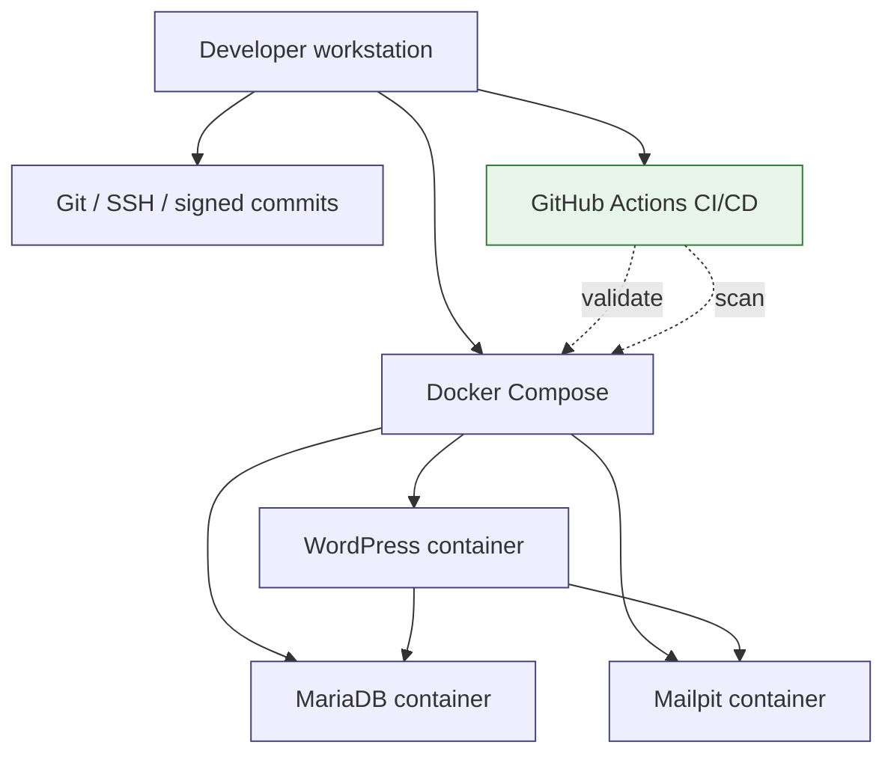

# local-first-wordpress-devsecops-kit
Local-first DevSecOps starter kit for regulated WordPress development: Docker Compose, privacy-safe data handling, AI boundaries, runbooks and audit evidence templates.

[](https://github.com/Jonnenpijonne/local-first-wordpress-devsecops-kit/actions/workflows/ci.yml)
[](https://github.com/Jonnenpijonne/local-first-wordpress-devsecops-kit/actions/workflows/security-scan.yml)
[](https://github.com/Jonnenpijonne/local-first-wordpress-devsecops-kit/actions/workflows/container-publish.yml)

**A lightweight, auditable and recoverable local development model for regulated WordPress-based platforms.**


---
## Status: v1.0.0 Production Ready

✅ **CI/CD Active** — Automated validation on every push  
✅ **Security Scanning** — Container & dependency scanning enabled  
✅ **Branch Protection** — Required checks before merge  
✅ **Release Tagged** — v1.0.0 ready for use  

---

## Validation status

Validated locally on Windows with WSL2, Docker Desktop and Git Bash.

Runtime result:
- WordPress available at `http://localhost:8080`
- Mailpit available at `http://localhost:8025`
- MariaDB reached healthy state
- Docker Compose lifecycle tested: `up`, `ps`, `down`, `up -d`, `exec`
- WordPress container shell access validated with `docker compose exec wordpress bash`
- Local Lighthouse audit captured for `http://localhost:8080/wp-admin/plugins.php`

Detailed evidence:
- `docs/evidence/LOCAL_VALIDATION_2026-06-15.md`
- `docs/evidence/LIGHTHOUSE_AUDIT_2026-06-15.md`
- `docs/ops/DOCKER_COMPOSE_LIFECYCLE_AUDIT.md`

---

## Purpose

This repository demonstrates a **local-first DevSecOps development baseline** for WordPress-based platforms that may later need to operate in regulated, privacy-aware or multi-tenant environments.

The goal is not to create a production platform locally.

The goal is to make local development:

* repeatable
* recoverable
* understandable
* safe by default
* easy to onboard
* auditable enough for early-stage governance
* protected from accidental production-data and AI-context leakage

In short:

> Anyone in the team should be able to clone the repository, start the stack and understand what is running — without cargo-culting Docker, leaking data or depending on one person's memory.

---

## Core idea

Most local development environments fail in the same way:

* setup depends on one person
* production data gets copied casually
* secrets end up in repositories or chats
* Docker is used without understanding what it actually isolates
* AI tools are given too much context
* no one knows what is safe to reset
* environments drift until they become snowflakes

This kit addresses those problems with a small, explicit and documented baseline:

```text
Docker Compose runtime
+ WordPress development stack
+ Git / SSH / signed commit workflow
+ no production data in development
+ anonymized dataset handling model
+ local AI boundary model
+ developer runbooks
+ evidence templates
+ GitHub Actions CI/CD
```

---

## Quick start

### Requirements

Install:

* Docker Desktop or Docker Engine + Docker Compose
* Git
* Bash-compatible shell

Check:

```bash
docker compose version
git --version
```

### Clone

```bash
git clone git@github.com:Jonnenpijonne/local-first-wordpress-devsecops-kit.git
cd local-first-wordpress-devsecops-kit
```

### Configure environment

```bash
cp .env.example .env
```

### Start stack

```bash
docker compose up -d
```

### Check containers

```bash
docker compose ps
```

### Open WordPress

```text
http://localhost:8080
```

---

## CI/CD Workflows

This repository includes three automated workflows:

### 1. DevSecOps CI
Runs on every push and PR:
- Validates docker-compose.yml syntax
- Scans for secrets (TruffleHog)
- Lints shell and Python scripts
- Builds Docker images
- Tests full stack startup
- Validates documentation

### 2. Security Scanning
Runs weekly and on push:
- Container vulnerability scanning (Trivy)
- Python security scanning (Bandit)
- Git history secret scanning
- License compliance check
- Docker Compose architecture audit

### 3. CD: Publish Stack
Runs on main branch push:
- Builds docker-compose stack snapshot
- Creates versioned artifacts
- Validates all services

---

## Key Features

* **Local-first development** — All services bound to localhost
* **Privacy-aware** — No production data in development
* **DevSecOps thinking** — Security from day one
* **Automated validation** — GitHub Actions CI/CD
* **Governance ready** — Documented policies and boundaries
* **AI boundary model** — Clear limits on AI tool usage
* **Evidence templates** — Audit trail ready

---

## Documentation Structure

```text
docs/
├── dev/                  # Development runbooks
├── privacy/              # Data anonymization guides
├── governance/           # Policies and boundaries
├── evidence/             # Validation templates
├── ops/                  # Operations and CI/CD setup
├── security/             # Security planning
└── releases/             # Release notes
```

---

## Architecture overview



---

## Next Steps

1. **Review the documentation** — Start with `docs/dev/LOCAL_DEV_ENVIRONMENT.md`
2. **Watch the workflows** — Go to Actions tab to see CI/CD in action
3. **Test locally** — Run `docker compose up -d` and explore
4. **Customize for your team** — Adjust policies in `docs/governance/`

---

## License

MIT License - See LICENSE file for details

---

## Final note

This project intentionally avoids unnecessary complexity.

The goal is not to build the biggest platform.

The goal is to build the smallest useful operating model that a team can understand, run, reset, review and improve.
