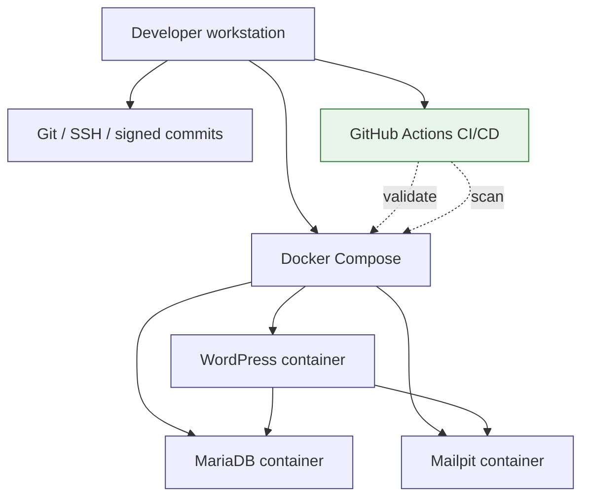

# local-first-wordpress-devsecops-kit

Local-first DevSecOps starter kit for regulated WordPress development: Docker Compose, privacy-safe data handling, AI boundaries, runbooks and audit evidence templates.

[](https://github.com/Jonnenpijonne/local-first-wordpress-devsecops-kit/actions/workflows/ci.yml)
[](https://github.com/Jonnenpijonne/local-first-wordpress-devsecops-kit/actions/workflows/security-scan.yml)
[](https://github.com/Jonnenpijonne/local-first-wordpress-devsecops-kit/actions/workflows/container-publish.yml)

**A lightweight, auditable and recoverable local development model for regulated WordPress-based platforms.**


---

## Status: v1.0.0 Local Development Ready

✅ **CI/CD Active** — Automated validation for the local development baseline  
✅ **Security Checks** — Container, Python and secret scanning included  
✅ **Branch Protection** — Review and status-check model documented  
✅ **Release Tagged** — v1.0.0 ready for local development use

## Local validation evidence

This repository has been validated locally on Windows with WSL2, Docker Desktop and Git Bash.

Validated runtime state:

- WordPress available at `http://localhost:8080`
- Mailpit available at `http://localhost:8025`
- MariaDB reached healthy state
- Docker Compose lifecycle tested: `up`, `ps`, `down`, `up -d`, `exec`
- WordPress container shell access validated with `docker compose exec wordpress bash`

Detailed evidence:

- `docs/evidence/LOCAL_VALIDATION_2026-06-15.md`
- `docs/evidence/LIGHTHOUSE_AUDIT_2026-06-15.md`
- `docs/ops/DOCKER_COMPOSE_LIFECYCLE_AUDIT.md`
---

## Purpose

This repository demonstrates a **local-first DevSecOps development baseline** for WordPress-based platforms that may later need to operate in regulated, privacy-aware or multi-tenant environments.

**The goal is not to create a production platform locally.**

The goal is to make local development:

* repeatable
* recoverable
* understandable
* safe by default
* easy to onboard
* auditable enough for early-stage governance
* protected from accidental production-data and AI-context leakage

In short:

> Anyone in the team should be able to clone the repository, start the stack and understand what is running — without cargo-culting Docker, leaking data or depending on one person's memory.

---

## Core idea

Most local development environments fail in the same way:

* setup depends on one person
* production data gets copied casually
* secrets end up in repositories or chats
* Docker is used without understanding what it actually isolates
* AI tools are given too much context
* no one knows what is safe to reset
* environments drift until they become snowflakes

This kit addresses those problems with a small, explicit and documented baseline:

```text
Docker Compose runtime
+ WordPress development stack
+ Git / SSH / signed commit workflow
+ no production data in development
+ anonymized dataset handling model
+ local AI boundary model
+ developer runbooks
+ evidence templates
+ GitHub Actions CI/CD
```

---

## Architecture principle

**Code is debt.**

Not because code is bad, but because every line creates future responsibility: maintenance, security, documentation, testing, ownership and operational risk.

Documentation is an asset when it makes the system understandable, transferable and recoverable.

Tests and audit evidence are what keep technical debt from becoming organizational risk.

**Complexity is not maturity.**
**Maturity is knowing what not to build yet.**

This kit intentionally stays small.

It is **not** Kubernetes.
It is **not** a production orchestration platform.
It is **not** an enterprise IAM system.
It is **not** a security silver bullet.

It is a controlled local development foundation.

---

## What this project is

This is:

* a local WordPress development runtime
* a Docker Compose onboarding model
* a privacy-aware development workflow
* a governance-oriented documentation baseline
* a local-first AI workflow boundary model
* a starter kit for regulated or compliance-sensitive development teams
* an automated CI/CD validation baseline

This is **not**:

* a production deployment strategy
* a hardened production architecture
* a full CI/CD release platform
* a complete data anonymization product
* an enterprise GRC system
* a replacement for proper security review
* a replacement for production-grade secrets management

---

## Target use cases

This kit is useful when a team needs to develop WordPress-based or PHP-based systems where local development must still respect operational discipline.

**Good fit:**

* WordPress platform development
* regulated or semi-regulated web platforms
* early-stage MedTech / healthtech / public-sector-adjacent projects
* multi-tenant or partner-portal concepts
* teams using AI tools in development
* teams that need safe onboarding and repeatable local environments
* teams that want governance before scale, without enterprise bureaucracy

**Poor fit:**

* production Kubernetes operations
* large-scale enterprise platform engineering as-is
* unmanaged hobby servers
* teams that do not want documentation, review or boundaries

---

## Design goals

### 1. One-command development environment

A developer should be able to run:

```bash
docker compose up -d
```

and get a working local WordPress stack.

### 2. Low-friction cognition

The environment should reduce memory load.

Developers should not need to remember a long ritual. The workflow should explain itself through:

* service names
* scripts
* runbooks
* health checks
* reset routines

### 3. No production data in development

Production data must not be copied directly into local environments.

Development datasets must be:

* minimized
* anonymized or pseudonymized
* scanned for secrets
* treated as confidential even after anonymization
* destroyed when replaced

### 4. AI is assistive, not autonomous

AI may assist with:

* documentation
* code suggestions
* troubleshooting
* summarization
* local development reasoning

AI must **not** autonomously:

* deploy
* merge to protected branches
* tag releases
* modify production controls
* exfiltrate data
* receive production datasets
* receive sensitive local development datasets through external SaaS tools without explicit approval

### 5. Governance before scale

The point is not to build a heavy governance machine.

The point is to make the basics explicit early:

* what runs
* who changed what
* what data was used
* what was anonymized
* what can be reset
* what must never be sent to external AI
* what is local-only
* what is future production work

---

## Quick start

### Requirements

Install:

* Docker Desktop or Docker Engine + Docker Compose
* Git
* Bash-compatible shell

Check:

```bash
docker compose version
git --version
```

### Clone

For developers with GitHub SSH configured:

```bash
git clone git@github.com:Jonnenpijonne/local-first-wordpress-devsecops-kit.git
cd local-first-wordpress-devsecops-kit
```

For public reviewers or without SSH setup:

```bash
git clone https://github.com/Jonnenpijonne/local-first-wordpress-devsecops-kit.git
cd local-first-wordpress-devsecops-kit
```


### Configure environment

```bash
cp .env.example .env
```

### Start stack

```bash
docker compose up -d
```

### Check containers

```bash
docker compose ps
```

### Open WordPress

```text
http://localhost:8080
```

---

## CI/CD Workflows

This repository includes automated workflows for validating the local development baseline.

### 1. DevSecOps CI

Runs on push and pull request:

- Validates `docker-compose.yml` syntax and service definitions
- Scans for secrets using TruffleHog and pattern matching
- Lints shell scripts with ShellCheck
- Validates Python helper scripts
- Checks `.env.example` and `.gitignore` structure
- Builds the Docker Compose services
- Starts the full stack (`docker compose up -d`) for runtime validation
- Checks documentation and governance template presence

### 2. Security Scanning

Runs on schedule and repository changes:

- Container vulnerability scanning with Trivy
- Python security scanning with Bandit
- Git history secret scanning
- License compliance check
- Docker Compose architecture audit

### 3. Container / Compose Stack Validation

Runs on main branch changes:

- Validates the Compose configuration
- Builds the stack services
- Creates a Compose configuration snapshot artifact
- Validates all services are ready

---

## Architecture overview



---

## Docker Compose baseline

The stack includes:

* **WordPress** — Latest official image, bound to `127.0.0.1:8080`
* **MariaDB** — Version 11, healthcheck enabled, volume-persisted
* **Mailpit** — Local email testing, bound to `127.0.0.1:8025`
* Custom Docker network for inter-service communication

Key principle: **all ports bind to localhost (`127.0.0.1`) to reduce accidental network exposure.**

---

## Reference repository structure

```text
local-first-wordpress-devsecops-kit/
│
├── README.md
├── docker-compose.yml
├── .env.example
├── .gitignore
│
├── .github/
│   └── workflows/
│       ├── ci.yml
│       ├── security-scan.yml
│       └── container-publish.yml
│
├── scripts/
│   ├── dev-up.sh
│   ├── dev-down.sh
│   ├── dev-health.sh
│   ├── dev-reset.sh
│   ├── scan-secrets.sh
│   └── anonymize-placeholder.py
│
├── docs/
│   ├── dev/
│   │   ├── LOCAL_DEV_ENVIRONMENT.md
│   │   ├── DOCKER_WORDPRESS_RUNBOOK.md
│   │   └── DEBUG_AND_RESET.md
│   │
│   ├── privacy/
│   │   ├── DATA_ANONYMIZATION_GUIDE.md
│   │   ├── DATA_CLASSIFICATION_TEMPLATE.md
│   │   └── DEVELOPMENT_DATA_RULES.md
│   │
│   ├── governance/
│   │   ├── AI_BOUNDARY_MODEL.md
│   │   ├── SSOT_AND_AUTHORITY_MODEL.md
│   │   ├── CHANGE_CONTROL.md
│   │   └── RISK_REGISTER.md
│   │
│   ├── ops/
│   │   ├── GITHUB_ACTIONS_CI_CD.md
│   │   └── GITHUB_RULESET_SETUP.md
│   │
│   ├── security/
│   │   └── SECURITY_NOTES.md
│   │
│   └── evidence/
│       ├── ANONYMIZATION_LOG_TEMPLATE.md
│       ├── LOCAL_ENVIRONMENT_VALIDATION_CHECKLIST.md
│       └── SECRET_SCAN_LOG_TEMPLATE.md
│
└── wp-content/
    └── .gitkeep
```

---

## Daily workflow

### Start

```bash
docker compose up -d
```

### Stop

```bash
docker compose down
```

### View status

```bash
docker compose ps
```

### View logs

```bash
docker compose logs -f
```

### View logs for one service

```bash
docker compose logs -f wordpress
docker compose logs -f db
```

### Enter WordPress container

```bash
docker compose exec wordpress bash
```

---

## Reset and rebuild

The goal is to recover through routines, not memory.

### Soft restart

```bash
docker compose restart
```

### Rebuild after dependency or configuration changes

```bash
docker compose up -d --build
```

### Full clean reset

⚠️ **Warning: removes persistent database volume.**

```bash
docker compose down -v
docker compose up -d --build
```

Use full reset only when local data is disposable.

---

## Privacy baseline

### Rule 1: No production data in development

Production data must not be copied directly into local development.

**Allowed:**

* generated dummy data
* manually created test data
* minimized and anonymized datasets
* approved pseudonymized development extracts

**Not allowed:**

* raw production database dumps
* real customer data
* real patient/user/customer identifiers
* production uploads folder
* API tokens, SMTP credentials or license keys
* secrets pasted into AI tools or chats

---

## AI boundary model

### Principle

**AI is assistive, not autonomous.**

AI can support development, documentation and troubleshooting, but it must not independently control delivery, production access or sensitive data movement.

### Allowed

AI may assist with:

- documentation drafts
- local troubleshooting
- explaining logs
- generating test ideas
- summarizing architecture
- suggesting scripts
- reviewing non-sensitive configuration
- helping with local development workflows

### Not allowed

AI must **not** independently:

- deploy
- merge to protected branches
- create release tags
- archive repositories
- modify production controls
- receive secrets
- receive raw production data
- receive local anonymized datasets through external SaaS tools without explicit approval
- bypass governance review

---

## Why this matters

This kit reduces:

* onboarding friction
* local environment drift
* production-data misuse
* AI context leakage
* undocumented setup knowledge
* "only one person knows how it works" risk
* fear of reset and rebuild
* hidden operational complexity

It increases:

* repeatability
* recoverability
* auditability
* developer confidence
* operational clarity
* privacy discipline
* governance maturity

---

## Portfolio summary

This project demonstrates:

* Docker Compose based WordPress local development
* local-first DevSecOps thinking
* privacy-aware development workflows
* anonymized data handling model
* AI boundary model
* audit evidence templates
* operational runbook writing
* lightweight governance before scale
* automated CI/CD validation baseline

The technical value is not only in the stack.

The value is in making the stack understandable, recoverable and transferable.

---


## License

MIT License - See LICENSE file for details

---

## Final note

This project intentionally avoids unnecessary complexity.

The goal is not to build the biggest platform.

The goal is to build the smallest useful operating model that a team can understand, run, reset, review and improve.
